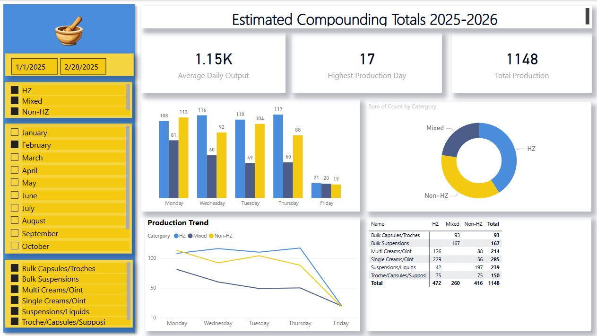

# Aspiring Business Analyst

#### Technical Skills: Power Bi, Microsoft Excel, Word, PowerPoint, Sharepoint
## Education
+ B.G.S, Minor in Health Administration | UCF (_Expected 2026_)
+ A.A. General                          | Valencia College					       		
+ Responsive Web Design Certificate     | FreecodeCamp

## Work Experience
**Packaging & Shipping Pharmacy Technician (Compounding) Publix Supermarkets Inc. | (_Dec 2024 – Present_)**
-	Analyzed inventory and prescription trend data to optimize workflow efficiency.
- Collaborated with pharmacists to verify prescriptions and ensure data accuracy in order processing.
- Managed shipment tracking and reporting, monitoring fulfillment patterns for process improvements.

**E3 Pharmacy Technician Specialty Rx | (_Apr 2024 – Dec 2024_)**
- Utilized automation systems to process and track over 5,000 patient orders daily, improving operational efficiency.
-	Diagnosed and resolved software and mechanical issues in automated systems, ensuring data integrity and minimizing downtime.
-	Developed insights from system performance metrics to enhance workflow automation.

**Central-Fill Pharmacy Technician Publix Supermarkets Inc. | (_Mar 2022 – Jan 2023_)**
- Analyzed prescription fulfillment data to identify and resolve processing inefficiencies, increasing accuracy by 10%.
- Provided technical support for Nexia store dispensing technology, troubleshooting data discrepancies and system errors.
- Assisted with the optimization of automated workflows, ensuring seamless data synchronization across pharmacy systems.

**Retail Pharmacy Technician Publix Supermarkets Inc. | (_Nov 2021 – Mar 2022_)**
- Managed pharmacy inventory and assisted with procurement, tracking stock levels to prevent shortages.
- Processed and reviewed prescription data for accuracy, ensuring compliance with regulatory requirements.
- Delivered insights on patient medication trends, helping improve stock management decisions.

## Projects
### Compounding Pharmacy Workflow Analysis Project
- The image displays a professionally designed Excel dashboard created using PowerPoint, Excel, Pivot Tables, and Slicers to track and analyze compounding production estimates for 2025-2026. This interactive dashboard leverages Excel's Pivot Tables to summarize large datasets efficiently and uses Slicers to filter data dynamically for better visualization and analysis. The dashboard was designed with PowerPoint and Excel, ensuring a professional and visually appealing layout. The combination of Pivot Tables and Slicers makes it a powerful tool for data-driven decision-making, optimizing production planning, and inventory management.
.JPG).JPG)

This Power BI dashboard provides a comprehensive overview of Estimated Compounding Totals for 2025-2026, integrating data from Excel and leveraging interactive slicers for dynamic data filtering.

